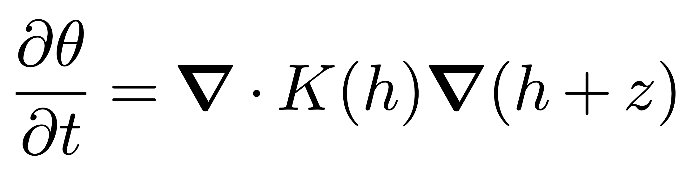

RichardsSolver
========================================================================
A numerical package for solving Richards' equation
------------------------------------------------------------------------

RichardsSolver is a Firedrake based package (https://www.firedrakeproject.org/) for numerically solving Richards' equation in two- and three-dimensional domains.

where theta is the moisture content, h is the pressure head, and K is the relative conductivity.

Requirements
============

- Python ≥ 3.10
- A working **Firedrake** installation (with PETSc) — follow the official instructions: https://www.firedrakeproject.org/install.html

Installation
============

Install into your *active Firedrake environment*:

.. code-block:: bash

   # clone and install in editable mode
   git clone https://github.com/MorrowL/RichardsSolver.git
   cd RichardsSolver
   pip install -e .

You can also install directly from GitHub without cloning:

.. code-block:: bash

   pip install "git+https://github.com/MorrowL/RichardsSolver.git"

Usage
=====

Basic usage example for the Tracy 2D analytical solution:

RichardsSolver is based on Firedrake, and as such, we recommend users to familiarise themselves with a few of the tutorials available at https://www.firedrakeproject.org/documentation.html. To perform simulations, users initialise the solver via

.. code-block:: python

    eq = RichardsSolver(V=V,
                        soil_curves=soil_curves,
                        bcs=richards_bcs,
                        solver_parameters=solver_parameters,
                        time_integrator=time_integrator,
                        quad_degree=3)

where V is the function of pressure head. For the soil curves, users have a choice of several hydrological models (HaverkampCurve, ExponentialCurve, and VanGenutchenCurve). An example of how the soil_curves dictionary is made:

.. code-block:: python

    soil_curve = HaverkampCurve(
        theta_r=0.025,         # Residual water content [-]
        theta_s=0.40,          # Saturated water content [-]
        Ks=1e-05,              # Saturated hydraulic conductivity [m/s]
        alpha=0.44,            # Fitting parameter [m]
        beta=1.2924,           # Fitting parameter [-]
        A=0.0104,              # Fitting parameter [m]
        gamma=1.5722,          # Fitting parameter [-]
        Ss=0,                  # Specific storage coefficient [1/m]
    )

richards_bcs is dictionary that contains information about boundary conditions. Boundary conditions can either be Diretchlet or Neumann (where the volumetric flux normal to the boundary is specified. An example dictionary: 

.. code-block:: python
    
    # Boundary conditions
    boundary_ids = get_boundary_ids(mesh)
    richards_bcs = {
        1 {'flux': 0.0},    # Left
        2: {'h': -10.0},    # Right
        3 {'flux': 0.0},    # Bottom
        4: {'flux': 1e-06}, # Top
    }

The numbers 1, 2, 3 and 4 correspond to the boundary IDs of the mesh. Note the boundary conditions can be spatially and/or temporally dependent.

solver_parameters are the parameters to solve the system of equations. Users can choose 'default', 'direct', 'iterative', or provide a dictionary of solver options. For 2D problems 'default' uses 'direct', while for 3D it uses 'iterativer'.

time_integrator is a string that specifies how Richards' equation is integrated in time. Current options are 'BackwardEuler', 'CrankNicolson', or 'ImplicitMidpoint'.

quad_degree specifies quadrature degree, where 2p + 1 is recommended with p being the polynomial degree of V.

Demos (ready to run)
--------------------

Each demo is self‑contained and can be launched from the repository root:

.. code-block:: bash

   # Tracy analytical (2-D / 3-D; exponential soil)
   python demos/tracy2d.py
   python demos/tracy3d.py

   # Vauclin water-table recharge (2-D; Haverkamp)
   python demos/vauclin2d.py

   # 3-D infiltration into heterogeneous soil (van Genuchten, spatially varying)
   python demos/hetero3d_vg.py

Documentation
=============

For complete API reference and examples, see the docstrings in each module:

License
=======

RichardsSolver is licensed under the GNU Lesser General Public License v3 (LGPLv3).
See LICENSE.txt for details.

Contributing
============

Contributions are welcome! Please submit issues and pull requests on GitHub:
https://github.com/MorrowL/RichardsSolver/
